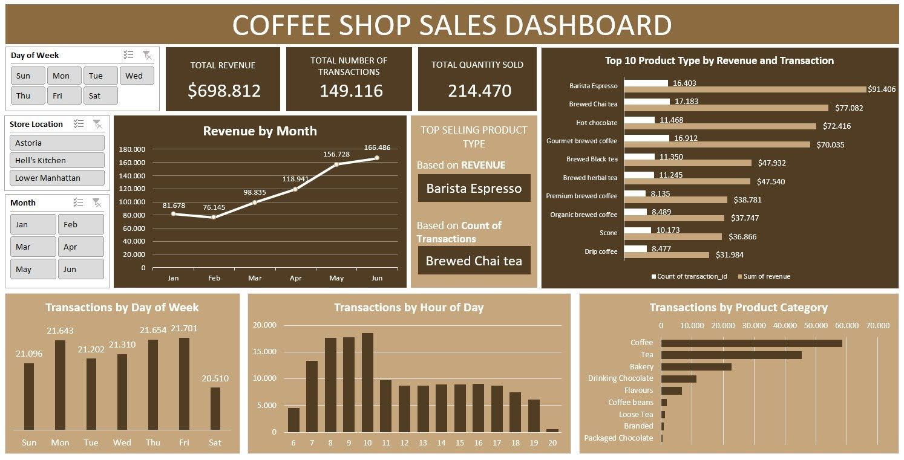

# ☕ Coffee Shop Sales Dashboard (Microsoft Excel)

## Project Overview
This project analyzes sales transactions from a coffee shop to uncover trends in revenue, product performance, and customer behavior. Using Microsoft Excel, I cleaned the dataset, calculated key performance metrics, and built an interactive dashboard to support quick business insights across time, product types, and store locations.

---

## Dataset
- **Dataset Name:** Coffee Shop Sales  
- **Description:** Transaction-level sales data for Maven Roasters, a fictitious coffee shop operating across three locations in New York City  
- **Number of Rows:** 149,456  
- **Number of Columns:** 11  

---

## Tools Used
- **Microsoft Excel**
  - Data cleaning and preparation  
  - PivotTables and PivotCharts  
  - KPI calculation  
  - Dashboard design with slicers  

---

## Key Metrics
- Total Revenue  
- Total Transactions  
- Total Quantity Sold  

---

## Files Included
- **`coffee_shop_sales_rawdata.xlsx`**  
  Raw transactional dataset.

- **`coffee_shop_sales_pivottable.xlsx`**  
  Pivot tables used for aggregation and analysis.

- **`coffee_shop_sales_dashboard.jpg`**  
  Final dashboard visualization.

---

## Dashboard Preview

---

## Key Insights
- Total revenue from January to June reached approximately **$699K**  
- Revenue peaked in **May and June**, indicating strong late-spring demand  
- **Brewed Chai Tea** had the highest number of transactions, while **Barista Espresso** generated the highest revenue  
- **Coffee** is the top-selling product category  
- Customer traffic is highest on **Monday, Thursday, and Friday**  
- Peak purchase hours occur between **8–10 AM**, while **Saturday** records the lowest transaction volume  
