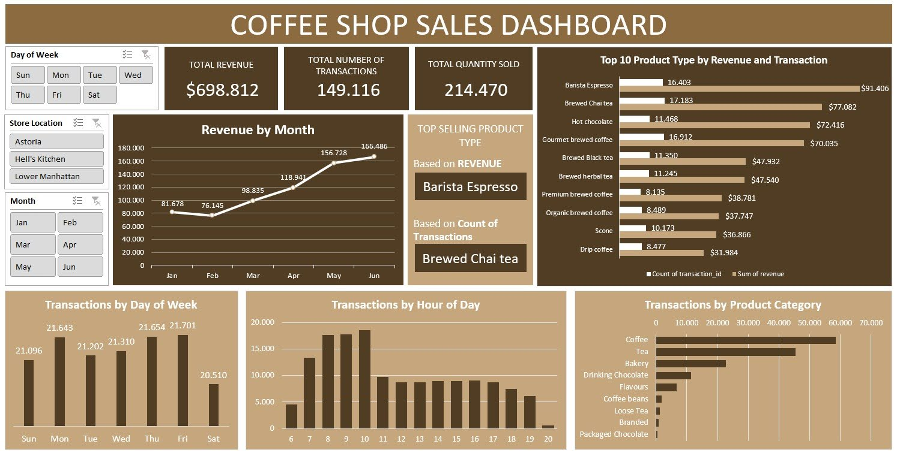

# ☕️ Coffee Shop Sales Dashboard (Microsoft Excel)

### 📊 Overview
This project analyzes retail sales data to identify trends, top-performing products, and regional performance.

### 🧰 Tools Used
- Excel (data cleaning, analysis, and visualization)

### 📎 Files
- `sales_data.xlsx` → cleaned dataset  
- `dashboard.jpg` → dashboard
 

### 🔍 Key Insights
- Region A generated the highest sales in Q4  
- Product Category B had the largest profit margin  
- Seasonal peaks occurred in November and December

