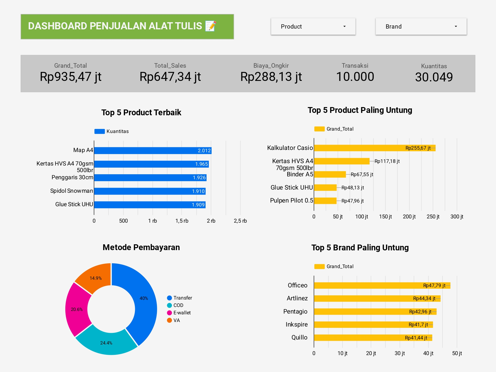

# 📏 Stationery Store Sales Dashboard (SQL & Looker Studio)

## Project Overview
This project analyzes sales data from a stationery store to understand transaction performance, product profitability, and customer payment behavior. SQL was used to join multiple tables, perform exploratory analysis, and calculate key business metrics, while Looker Studio was used to build an interactive dashboard that summarizes key business metrics and insights.

The dataset consists of four related tables: **Transactions**, **Status**, **Customer**, and **Payment**, simulating a real-world transactional database structure.

---

## Dataset Structure
The dataset consists of four related tables representing a transactional sales system:
- **Transactions**  
  Product-level sales records, including quantity, price, and transaction value.  
  **Number of Rows:** 10,000  
  **Number of Columns:** 12  
- **Status**  
  Order status information linked to each transaction.  
  **Number of Rows:** 10,000  
  **Number of Columns:** 2  
- **Payment**  
  Payment method for each transaction.  
  **Number of Rows:** 10,000  
  **Number of Columns:** 2 
- **Customer**  
  Customer demographic and identification data.  
  **Number of Rows:** 10,000  
  **Number of Columns:** 5  

---

## Tools Used
- **SQL**
  - Data exploration and analysis  
  - Joining multiple tables  
  - KPI calculation and aggregation  

- **Looker Studio**
  - Dashboard design  
  - Interactive filters (product, brand)  
  - KPI and chart visualization  

---

## Files Included
- **`TokoAlatTulis.xlsx`**  
  Raw dataset containing all tables.

- **`stationery_store_sales_queries.sql`**  
  SQL queries used for data cleaning and analysis.

- **`stationery_store_dashboard.jpg`**  
  Final dashboard visualization.

---

## Dashboard Preview

---

## Key Insights
- The dataset contains **10,000 transactions** with a total of **30,049 units sold**  
- **Grand total revenue (including shipping)** reached approximately **Rp 935 million**  
- **Product-only sales revenue** totaled **Rp 647 million**  
- **Shipping costs** accounted for **Rp 288 million**, a significant portion of total value  
- **A4 Map** is the most frequently purchased product  
- **Casio Calculator** generates the highest revenue among all products  
- **Money Transfer** is the most commonly used payment method

---

## Live Dashboard
https://lookerstudio.google.com/s/jkO2UIEPws4
