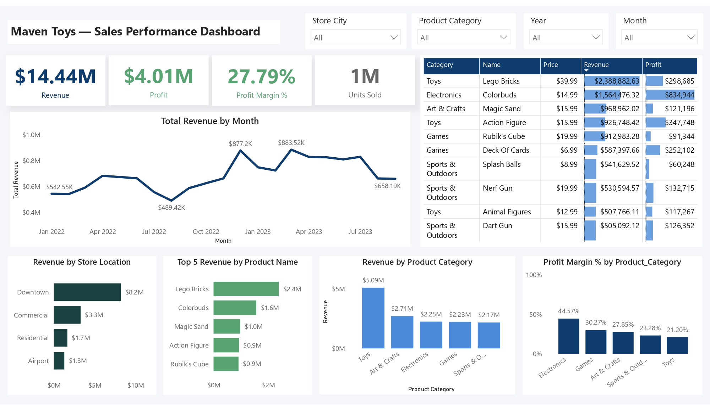

# 🧸 Maven Toys Sales Performance Dashboard (Power BI)

## Project Overview
This project analyzes sales performance data from **Maven Toys**, a fictitious toy store chain operating across multiple cities in Mexico.  
The objective is to evaluate overall business performance, identify top-performing products and store locations, and understand revenue and profitability trends over time.

An interactive Power BI dashboard was built to present key metrics and insights in a clear, business-focused format.

---

## Dataset Information
The dashboard is built using multiple related tables to represent a typical retail data model:

- **Sales** – transaction-level sales data    
  **Number of Rows:** 829,262  
  **Number of Columns:** 5  
- **Products** – product details, categories, and pricing    
  **Number of Rows:** 35  
  **Number of Columns:** 5
- **Stores** – store name and locations    
  **Number of Rows:** 50  
  **Number of Columns:** 5
- **Calendar** – date dimension used for time-based analysis    
  **Number of Rows:** 638  
  **Number of Columns:** 1        

An additional **Inventory** table is available in the dataset but was **not used** in this dashboard, as inventory-related metrics were outside the scope of this analysis.

---

## Tools Used
- **Power BI** – data modeling, analysis, and dashboard visualization  
- **Power Query** – data transformation and preparation  
- **DAX** – calculated measures (Total Revenue, Total Profit, Profit Margin %, Units Sold)

---

## Key Metrics
- Total Revenue  
- Total Profit  
- Profit Margin (%)  
- Units Sold  
- Revenue by Product Category and Store Location  

---

## Files Included
- **`raw_data/`** – raw dataset  
- **`Maven Toys.pbix`** – Power BI report file  
- **`maven_toys_dashboard.jpg`** – dashboard preview image  

---

## Dashboard Preview

---

## Key Insights
- **Downtown** stores generate the highest total revenue among all locations.  
- **Toys** is the highest-revenue product category overall.  
- **Electronics** products have the highest profit margin despite lower total revenue.  
- Revenue peaks occurred in late 2022 and early 2023, indicating seasonal demand patterns.  
- Top-selling products do not always have the highest profit.

---

## Live Dashboard
https://app.powerbi.com/links/8t36qES7z0?ctid=fedd5298-8e66-45f1-b321-fd38ad0ff722&pbi_source=linkShare
